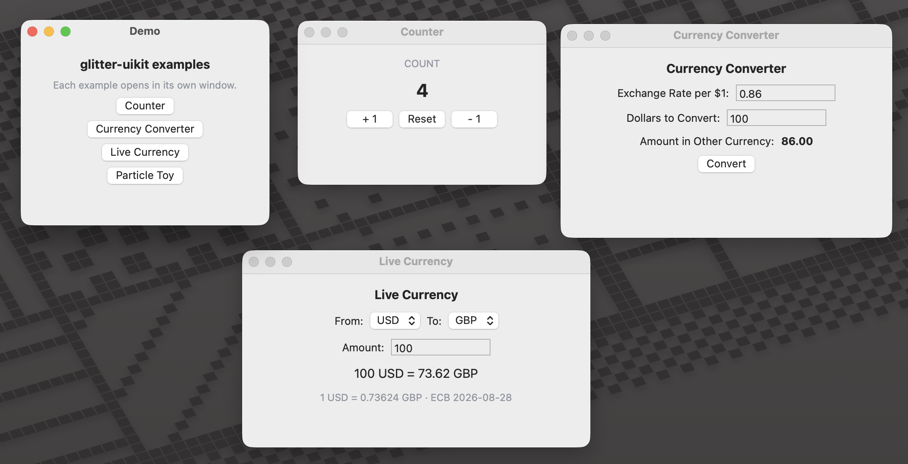
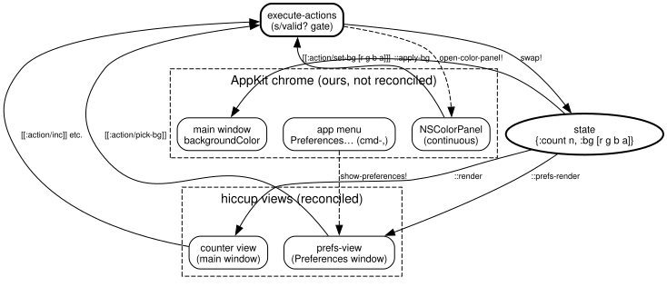
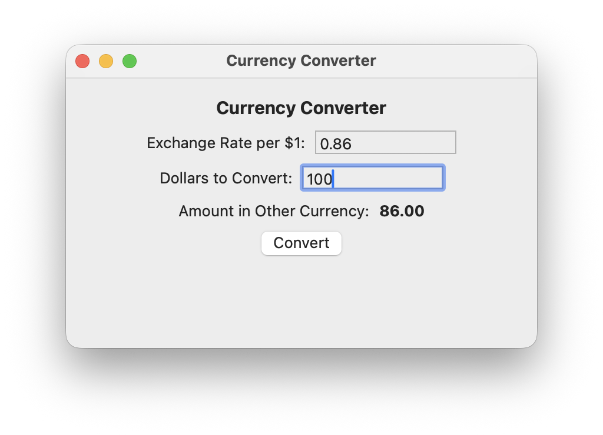
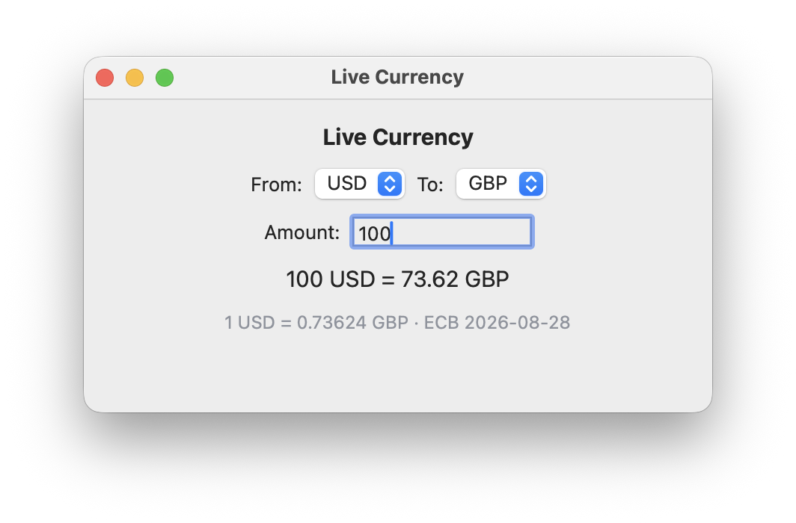

#+title: README
#+author: Larry Staton
#+date: 30 August 2026

* Introduction

A literate demo of [[https://github.com/jlt-commons/glitter-uikit][glitter-uikit]] — the native macOS (AppKit) renderer for
[[https://github.com/jlt-commons/glitter][glitter]], a Replicant-style reconciler for Clojure (well, [[https://github.com/jolt-lang/jolt][Jolt]]). The mental
model, if you come from the web: glitter is the reconciler, AppKit is the DOM.
Hiccup in, real =NSButton=​s out.

#+caption: The hub and every example, live — all tangled from this document.

(There's a [[file:media/live-fx.mov][screen recording]] of Live Currency fetching real ECB rates as the
currencies change, and a [[*Gallery][gallery]] of the individual windows below.)

The toolchain installs from a Brewfile — tangled from this document, of
course — with =brew bundle --file=./Brewfile= (explicit on purpose: anyone
with =HOMEBREW_BUNDLE_FILE= pointing at a global Brewfile would otherwise
install that one instead):

#+begin_src ruby :tangle Brewfile :comments link
tap  "jolt-lang/jolt"
brew "jolt-lang/jolt/jolt"   # the jolt runtime/compiler
brew "gtk4"                  # required transitively by glitter's :jolt/native (see Dependencies)
brew "emacs"                 # tangles this document
brew "graphviz"              # renders the dataflow diagram
brew "ffmpeg"                # converts the screen recording to an inline GIF
#+end_src

(Emacs also needs =clojure-mode= for the tangle's =:comments link= breadcrumbs:
=M-x package-install RET clojure-mode= once, from any Emacs — it lands in
=~/.emacs.d/elpa=, where the batch tangle's =package-initialize= finds it.)

This Org file is the source of truth for the whole project. Every code block
below tangles into =deps.edn= or =src/demo/core.clj=:

#+begin_example
jolt tangle   # regenerate deps.edn and src/ from this file
jolt demo     # run the app
#+end_example

The project is a set of literate notebooks, not one. This top-level file owns
the toolchain (=Brewfile=, =deps.edn=), the app shell (menu bar, preferences,
=.app= bundling), and the *hub* — a main window listing every example as a
button, each opening in its own window. Each example is its own notebook,
tangling its own namespace:

#+begin_example
README.org                     → Brewfile, deps.edn, src/demo/registry.clj, src/demo/core.clj
examples/counter/README.org    → src/demo/examples/counter.clj
examples/currency/README.org   → src/demo/examples/currency.clj
examples/particles/README.org  → src/demo/examples/particles.clj
#+end_example

Per-directory =README.org= means GitHub renders every example's page in place.
One org-mode landmine made this shape necessary: =#+INCLUDE:= is /export/-only
— =org-babel-tangle= does not follow it — so a single README including
children could never tangle them. Instead the =tangle= task finds and tangles
every notebook; =:tangle= paths are relative to each org file, so examples
write into the shared =src/= tree with =../../src/...= paths and a single
=:paths ["src"]= serves everything.

*Never edit the tangled files directly* — the next tangle clobbers them (ask me
how I know). The blocks use =:comments link=, so each tangled file carries
breadcrumbs back to its source section here, and =org-babel-detangle= can flow
an accidental direct edit back into this file.

* Dependencies

Both libraries are pinned git deps. Two things learned the hard way:

1. *The glitter pin must match the one glitter-uikit itself pins.* Jolt's deps
   walk is breadth-first, so a top-level coordinate silently overrides the
   transitive one — a newer sha here would override what glitter-uikit was
   built and tested against.
2. *GTK4 must be installed* (=brew install gtk4=) even though this demo renders
   pure AppKit. glitter's own =deps.edn= declares GTK natives under
   =:jolt/native=, Jolt inherits a dependency's natives transitively, and it
   hard-fails before any namespace loads when one is missing.

=clojure.spec= needs an explicit declaration here, unlike on the JVM: jolt *is*
Clojure, so =org.clojure/clojure= is a /terminal/ dependency — it contributes
neither an artifact nor children, which means it never drags in
=spec.alpha= transitively the way the JVM artifact does. Declared explicitly,
it's an ordinary (pure-Clojure) dependency; =jolt.deps= handles =:mvn/version=
coordinates alongside git ones.

The =tangle= task runs batch Emacs, which skips init files — hence the explicit
=package-initialize=, which puts =clojure-mode= on the load path
(=:comments link= needs it to know Clojure's comment syntax).

#+begin_src clojure :tangle deps.edn :comments link
{;; ffi/write took (p t offset v) before jolt 0.8.0 and (p t v offset) after,
 ;; and the two cannot be told apart at runtime — so an older jolt must
 ;; refuse, not guess (see "jolt 0.8.0: the write order"). glitter-uikit and
 ;; http-client declare the same floor.
 :jolt/min-version "0.8.0"
 :paths ["src"]

 ;; burinc → jlt-commons: both repos moved, and glitter-uikit now pins glitter
 ;; under the jlt-commons name — rule 1's override only works when the
 ;; coordinate NAMES match, so ours are renamed to match.
 :deps {io.github.jlt-commons/glitter
        {:git/url "https://github.com/jlt-commons/glitter"
         :git/sha "33713d607d11cc1fbf8cda237c0b6f251ac43388"}
        ;; 48f793b: ffi/write's value before the offset (jolt 0.8.0), plus CI/docs.
        io.github.jlt-commons/glitter-uikit
        {:git/url "https://github.com/jlt-commons/glitter-uikit"
         :git/sha "48f793be6f09fe093497108a7c013d1d3586ef37"}
        ;; NOT transitive under jolt (org.clojure/clojure is terminal) — see prose.
        org.clojure/spec.alpha {:mvn/version "0.5.238"}
        ;; clj-http-lite over jolt host shims (BSD sockets + OpenSSL via jolt.ffi
        ;; — no JVM); the Live Currency example fetches ECB rates with it.
        ;; 177b1ce: ffi/write's value before the offset (jolt 0.8.0); nothing
        ;; else changed in src/.
        jolt-lang/http-client
        {:git/url "https://github.com/jolt-lang/http-client"
         :git/sha "177b1ce4e529ffe052e6a1b7b103ed924de535f6"}
        ;; Pure-Clojure JSON, and the host API it needs under jolt: data.json's
        ;; date writers use java.time.format.DateTimeFormatter, which RFC 0008
        ;; moves out of jolt core into jolt-lang/time — jolt's load error says
        ;; exactly this, by name, when the dep is missing.
        org.clojure/data.json {:mvn/version "2.5.1"}
        io.github.jolt-lang/time
        {:git/url "https://github.com/jolt-lang/time"
         :git/sha "790b040a80dcca6cf853475e2a8feb802fb1b14b"}}

 :aliases {:demo {:main-opts ["-m" "demo.core"]}}

 ;; README.org is the source of truth; `jolt tangle` regenerates this file and
 ;; src/ from it. Never edit the tangled files directly.
 :tasks {tangle "find . -name README.org -not -path './Demo.app/*' | xargs -I{} emacs --batch -l package --eval '(package-initialize)' -l org {} -f org-babel-tangle"
         demo   "jolt -M:demo"
         ;; LaunchServices refuses script executables (see The -10669 saga);
         ;; jolt build AOT-compiles the app into a self-contained Mach-O that
         ;; IS the bundle executable (see The launcher dissolves).
         bundle "mkdir -p Demo.app/Contents/MacOS && jolt build -m demo.core -o Demo.app/Contents/MacOS/demo && rm -rf Demo.app/Contents/MacOS/demo.build"
         app    "open Demo.app"
         diagram "dot -Tsvg dataflow.dot -o dataflow.svg"
         ;; GitHub won't inline-play a .mov inside an org file, so the gallery
         ;; embeds a GIF. Palette-based single pass keeps the colors clean.
         media  "ffmpeg -y -i media/live-fx.mov -vf 'fps=12,scale=720:-1:flags=lanczos,split[a][b];[a]palettegen[p];[b][p]paletteuse' media/live-fx.gif"}}
#+end_src

* Namespace

Four requires, four layers: =app= is the NSApplication bootstrap (run loop,
cross-thread marshalling), =appkit= is the IRender implementation that mounts
hiccup into a window, =ffi= is raw =objc_msgSend= plus helpers (aliased =u= by
convention), =widget= is the widget factory and the shared ObjC target class —
we need it below to piggyback on its action registry. =core= is toolkit-agnostic
glitter itself. =jolt.ffi= is Jolt's own FFI layer, required directly so the
menu-bar section below can bind a few CoreFoundation functions that
=glitter-uikit.ffi= doesn't wrap.

The =demo.registry= require is the seam the multi-notebook structure turns on
(next section); the =demo.examples.*= requires are how examples join the hub —
adding an example to the app is adding one line here.

#+begin_src clojure :tangle src/demo/core.clj :mkdirp true :comments link
(ns demo.core
    (:require [clojure.spec.alpha :as s]
              [demo.registry :as reg]
              [demo.examples.counter]
              [demo.examples.currency]
              [demo.examples.fx]
              [demo.examples.particles]
              [glitter-uikit.app :as app]
              [glitter-uikit.appkit :as appkit]
              [glitter-uikit.ffi :as u]
              [glitter-uikit.widget :as w]
              [glitter.alias :as alias]
              [glitter.core :as core]
              [jolt.ffi :as ffi]))
#+end_src

* The registry

Examples must register themselves with the hub, and the dispatcher must accept
action kinds it has never heard of — both are /open/ seams, and both live in
their own small namespace so example notebooks can require it without
circularity (=demo.core= requires the examples; the examples require only
=demo.registry=).

Two pieces of open machinery, mirrored:

- =run-action!= is a *multimethod* on the action's kind — each notebook
  =defmethod=​s its own actions next to the feature they serve.
- =action-spec= is a multimethod returning the /spec/ for each kind, knitted
  into one open spec with =s/multi-spec= — so validation stays ahead of every
  FFI call (the running theme), yet each notebook extends it independently. An
  unknown kind has no method and is invalid: typos still get caught.

The dispatcher keeps the two failure policies established earlier: /warn/ on an
invalid batch mid-interaction, /throw/ at registration time (=register-example!=
conforms before any window exists).

#+begin_src clojure :tangle src/demo/registry.clj :mkdirp true :comments link
(ns demo.registry
  "Open seams: the example registry and the extensible action dispatcher.
  Example notebooks require this namespace only — never demo.core."
  (:require [clojure.spec.alpha :as s]
            [glitter.core :as core]))

;; --- the example registry ----------------------------------------------------
(s/def ::id keyword?)
(s/def ::title string?)
(s/def ::view fn?)
(s/def ::state some?)          ; a derefable state atom (no portable Atom class check)
(s/def ::width pos-int?)
(s/def ::height pos-int?)
(s/def ::on-open fn?)   ; optional: (fn [window-ptr]), runs on every open/reopen
(s/def ::example (s/keys :req-un [::id ::title ::view ::state ::width ::height]
                         :opt-un [::on-open]))

(defonce examples (atom []))

(defn register-example!
  "Add (or replace, by :id) an example. Conforms before anything is built."
  [ex]
  (when-not (s/valid? ::example ex)
    (throw (ex-info (str "Invalid example: " (s/explain-str ::example ex))
                    {:example ex})))
  (swap! examples (fn [xs] (conj (vec (remove #(= (:id %) (:id ex)) xs)) ex)))
  nil)

;; --- the open action pipeline ------------------------------------------------
(defmulti action-spec
  "Spec for one action vector, dispatched on its kind. Each notebook
  defmethods its own kinds; no method means invalid — typos stay loud."
  first)

(s/def ::action (s/multi-spec action-spec (fn [g _] g)))
(s/def ::actions (s/coll-of ::action))

(defn event-value
  "The value carried by an event — an entry's text, a checkbox state, a
  drop-down index. The renderer puts :glitter/value in its RAW event map, but
  glitter.core/build-event-map nests that whole map under :glitter/dom-event
  (lifting only :glitter/node), so the value is one level down from where
  you'd look first. Upstream's temperature.clj documents the same finding and
  resolves it with an identical get-in in its nexus placeholder."
  [event]
  (get-in event [:glitter/dom-event :glitter/value]))

(defmulti run-action!
  "Interpret one action vector. `event` is glitter's wrapped event map —
  read values with `event-value`, not (:glitter/value event)."
  (fn [_event action] (first action)))

(defmethod run-action! :default [_ action]
  (println "Unhandled action:" (pr-str action)))

(defn execute-actions [event actions]
  (when-not (s/valid? ::actions actions)
    (println "Invalid actions:" (s/explain-str ::actions actions)))
  (doseq [a actions] (run-action! event a)))

(core/set-dispatch! execute-actions)
#+end_src

* State

Replicant's state-atom pattern: one atom holds the world, =mount!= watches it,
and every =swap!= re-reconciles the view (marshalled onto the AppKit main
thread by the renderer, so it's safe to swap from anywhere — an nREPL eval
included).

=:bg= is the one preference: the main window's background color as an sRGB
=[r g b a]= vector, =nil= meaning "system default". Plain data, so it specs,
prints, and diffs like everything else.

=:count= used to live here too — it moved out with the counter to
[[file:examples/counter/README.org][its own notebook]] when the main window became the hub. App-level state and
example state are separate atoms on purpose: examples can't trample each other
or the shell.

#+begin_src clojure :tangle src/demo/core.clj :comments link
(defonce state (atom {:bg nil}))
#+end_src

* View

A pure =state -> hiccup= function. =:vbox= / =:hbox= are literally
=NSStackView=​s with the orientation preset; a bare string child becomes its own
=NSTextField= label. Everything you know about stack view behavior applies,
because that's what these are.

The original main-window view was the counter — kept below untangled; it lives
on, nearly verbatim, in [[file:examples/counter/README.org][examples/counter]]:

#+begin_src clojure :tangle no
(defn view [{:keys [count]}]
  [:vbox {:spacing 12}
   [:label {:label (str "Count: " count)}]
   [:hbox {:spacing 8}
    [:button {:label "+ 1" :on {:click [[:action/inc]]}}]
    [:button {:label "Reset" :on {:click [[:action/reset]]}}]
    [:button {:label "- 1" :on {:click [[:action/dec]]}}]]])
#+end_src

The main window is now the *hub*: one button per registered example, derived
from the registry. The registry is populated at require time (the
=demo.examples.*= lines in the ns form), so it's complete before the first
render.

#+begin_src clojure :tangle src/demo/core.clj :comments link
(defn hub-view [_state]
  (into [:vbox {:spacing 8 :margin 16}
         [:label {:markup [:span {:size "large" :weight "bold"} "glitter-uikit examples"]}]
         [:label {:markup [:span {:size "small" :foreground "#8e939d"}
                           "Each example opens in its own window."]}]]
        (for [{:keys [id title]} @reg/examples]
          [:button {:label title :on {:click [[:action/open-example id]]}}])))
#+end_src

Polish notes, used everywhere from here on: boxes take =:margin= (edge insets
on the =NSStackView=), and labels take =:markup= — Pango-style hiccup
(=[:span {:size "large" :weight "bold"} ...]=) validated against Pango's
vocabulary and rendered to an =NSAttributedString=, with muted grays via
=:foreground=.

* Actions

Events carry pure data (=[[:action/inc]]=), and one dispatcher interprets them.
The event map handlers receive also carries =:glitter/appkit-view= — the raw
sender pointer — as a per-widget escape hatch into AppKit.

Data-driven UIs earn their keep when the data validates itself: each action is
a vector whose head is a known kind (=s/cat= leaves room for arguments later),
and the dispatcher checks the batch before interpreting it. A typo'd action in
some =:on {:click ...}= prints an =explain= instead of being silently swallowed
by the =case= default — the counter still works, but the mistake is loud.

The =s/cat= promise gets kept below: =:action/set-bg= is the first action that
carries an argument, so =::action= splits into a nullary branch and per-kind
argument branches. The dispatcher also grew two /effectful/ actions for the
preferences flow (=:action/pick-bg= opens the color panel; the panel's own
changes come back through =:action/set-bg=) — =declare='d here, defined in the
Preferences section.

The closed =case= dispatcher below served until the app grew multiple example
notebooks — a =case= (and a closed =s/or=) can't learn kinds it has never seen,
so both were superseded by =demo.registry='s multimethod pair (=run-action!= +
=action-spec= under =s/multi-spec=). Kept untangled; the shape is worth
remembering because every closed dispatcher looks this reasonable right before
it can't grow:

#+begin_src clojure :tangle no
(declare open-color-panel!)

(s/def ::rgba (s/coll-of number? :count 4))
(s/def ::action
  (s/or :nullary (s/cat :kind #{:action/inc :action/dec :action/reset
                                :action/pick-bg})
        :set-bg  (s/cat :kind #{:action/set-bg} :color ::rgba)))
(s/def ::actions (s/coll-of ::action))

(defn execute-actions [_event actions]
  (when-not (s/valid? ::actions actions)
    (println "Invalid actions:" (s/explain-str ::actions actions)))
  (doseq [[kind arg] actions]
    (case kind
      :action/dec (swap! state update :count dec)
      :action/inc (swap! state update :count inc)
      :action/reset (swap! state assoc :count 0)
      :action/pick-bg (open-color-panel!)
      :action/set-bg (swap! state assoc :bg arg)
      nil)))

(core/set-dispatch! execute-actions)
#+end_src

Actions now live beside the features they serve: the counter's in its
notebook, the hub's =:action/open-example= in the Opening-examples section,
the preferences pair next to the color panel.

* Toolbar experiments

The reconciler owns only the window's *content view*, which cuts both ways: no
declarative titlebar widgets, but the titlebar is territory we can claim with
raw AppKit and never fight the diff.

A full =NSToolbar= needs a delegate to vend its items, which means building an
ObjC class at runtime (doable — =glitter-uikit.widget= builds its
=GlitterTarget= class exactly that way — but fiddly). The better
effort-to-payoff ratio is =NSTitlebarAccessoryViewController=: park any view in
the titlebar, no delegate protocol required.

The fun part is the event wiring. Every glitter control shares ONE target — the
=GlitterTarget= instance at =w/invoker= — whose =fire:= IMP looks the sender
pointer up in the =w/actions= registry and runs whatever handlers are
registered. So our hand-rolled button joins the same machinery the reconciler
uses: make =w/invoker= its target, =fire:= its action, and register a handler
under the button's pointer.

#+begin_src clojure :tangle no :comments link
(defn add-titlebar-button!
  "Park a bordered button in `window`'s titlebar, on the trailing side.
  `on-click` is a zero-arg fn, invoked on the AppKit main thread."
  [window title on-click]
  (let [btn  (u/objc-msg-send-3p (u/cls "NSButton")
                                 (u/sel "buttonWithTitle:target:action:")
                                 (u/nsstring title) w/invoker (u/sel "fire:"))
        tavc (u/objc-msg-send-0
              (u/objc-msg-send-0 (u/cls "NSTitlebarAccessoryViewController")
                                 (u/sel "alloc"))
              (u/sel "init"))]
    ;; Join the shared action registry: fire: dispatches on the sender pointer.
    (swap! w/actions assoc-in [btn :click] (fn [_sender] (on-click)))
    ;; The accessory view's frame drives the titlebar layout — size it now.
    (u/objc-msg-send-0void btn (u/sel "sizeToFit"))
    (u/objc-msg-send-1pvoid tavc (u/sel "setView:") btn)
    (u/objc-msg-send-1i64void tavc (u/sel "setLayoutAttribute:") u/ATTR-TRAILING)
    (u/objc-msg-send-1pvoid window (u/sel "addTitlebarAccessoryViewController:") tavc)
    btn))
#+end_src

* Menu bar

An unbundled process (which =jolt demo= is — no =.app=, no =Info.plist=) gets a
menu bar with one bold entry named after the *process*, hence "jolt". Two
separate problems hide in here:

1. *The app menu's title.* AppKit ignores whatever title you set on the menu
   itself — the bar draws the bundle's =CFBundleName=, falling back to the
   process name. The in-process workaround: =CFBundleGetInfoDictionary= on the
   main bundle returns a live, mutable dictionary, and seeding =CFBundleName=
   into it *before* =NSApplication= initializes makes AppKit read our name
   instead. (=NSString*= and =CFStringRef= are toll-free bridged, so
   =u/nsstring= works as a CF key/value.) This is a well-worn hack, not API —
   the real fix is a proper =Info.plist=, which the [[*Bundling a .app][Bundling a .app]] section
   supplies; the hack stays so plain =jolt demo= runs get the right name too.
2. *The menu's contents.* Fully supported — and menu items are a great fit for
   plain data, in the same spirit as hiccup. Each item is a map; =:separator=
   stands for itself. An item carries either an =:action= — an ObjC selector
   string sent to a *nil* target, resolving through the responder chain, which
   is how all the standard app-menu items (About, Hide, Hide Others, Show All,
   Quit) work with zero code on our side — or a =:handler=, a Clojure fn wired
   through the same =GlitterTarget=​/​=fire:= registry as the toolbar button, with
   the =NSMenuItem= pointer as the registry key.

   Two AppKit details worth knowing:

   - Key equivalents default to the ⌘ modifier; anything else (Hide Others is
     ⌥⌘H) sets =keyEquivalentModifierMask= explicitly from the
     =NSEventModifierFlag= bits.
   - =NSMenu= auto-enables items by validating the responder chain: a nil-target
     item whose selector nobody answers gets disabled for free. That's why the
     standard items "just work" and a typo'd selector shows up grayed out
     rather than crashing.

The first cut hardcoded a single Quit item — kept here untangled, because it
shows the raw shape (alloc/init, =addItem:=, =setSubmenu:=, =setMainMenu:=)
before the data-driven version below abstracted it. Superseded, not wrong:

#+begin_src clojure :tangle no
(defn install-main-menu!
  "Install a minimal main menu: the app menu with a ⌘Q quit item."
  [app-name]
  (let [menubar  (u/objc-msg-send-0 (u/cls "NSMenu") (u/sel "new"))
        app-item (u/objc-msg-send-0 (u/cls "NSMenuItem") (u/sel "new"))
        app-menu (u/objc-msg-send-1p (u/objc-msg-send-0 (u/cls "NSMenu") (u/sel "alloc"))
                                     (u/sel "initWithTitle:") (u/nsstring app-name))
        quit     (u/objc-msg-send-3p (u/objc-msg-send-0 (u/cls "NSMenuItem") (u/sel "alloc"))
                                     (u/sel "initWithTitle:action:keyEquivalent:")
                                     (u/nsstring (str "Quit " app-name))
                                     (u/sel "terminate:")
                                     (u/nsstring "q"))]
    (u/objc-msg-send-1pvoid app-menu (u/sel "addItem:") quit)
    (u/objc-msg-send-1pvoid app-item (u/sel "setSubmenu:") app-menu)
    (u/objc-msg-send-1pvoid menubar (u/sel "addItem:") app-item)
    (u/objc-msg-send-1pvoid (u/shared-application) (u/sel "setMainMenu:") menubar)))
#+end_src

#+begin_src clojure :tangle src/demo/core.clj :comments link
;; CoreFoundation bindings glitter-uikit.ffi doesn't carry.
(ffi/defcfn cf-bundle-get-main-bundle  "CFBundleGetMainBundle"      []         :pointer)
(ffi/defcfn cf-bundle-info-dictionary  "CFBundleGetInfoDictionary"  [:pointer] :pointer)
(ffi/defcfn cf-dictionary-set-value    "CFDictionarySetValue"       [:pointer :pointer :pointer] :void)

(defn set-app-name!
  "Seed CFBundleName in the main bundle's live info dictionary so the app
  menu's title reads `name` instead of the process name. Must run before
  NSApplication initializes — i.e. before app/run."
  [name]
  (let [dict (cf-bundle-info-dictionary (cf-bundle-get-main-bundle))]
    (cf-dictionary-set-value dict (u/nsstring "CFBundleName") (u/nsstring name))))

;; NSEventModifierFlags — key-equivalent modifiers. ⌘ is the implicit default.
(def MOD-SHIFT   (bit-shift-left 1 17))
(def MOD-CONTROL (bit-shift-left 1 18))
(def MOD-OPTION  (bit-shift-left 1 19))
(def MOD-COMMAND (bit-shift-left 1 20))

;; Menu items conform BEFORE any FFI call touches them: an invalid spec fails
;; at install time with an explain, not as a grayed-out item or a segfault.
(s/def ::title string?)
(s/def ::action string?)                          ; ObjC selector name
(s/def ::handler fn?)
(s/def ::key (s/and string? #(= 1 (count %))))    ; single-char key equivalent
(s/def ::modifiers nat-int?)
(s/def ::menu-item
  (s/and (s/keys :req-un [::title] :opt-un [::action ::handler ::key ::modifiers])
         ;; an item answers to the responder chain OR to Clojure — not both
         (fn [{:keys [action handler]}] (not (and action handler)))))
(s/def ::menu-items (s/coll-of (s/or :separator #{:separator}
                                     :item ::menu-item)))

(defn- menu-item
  "Realize one item spec into an NSMenuItem.
  {:title \"...\"                ; required
   :action \"selectorName:\"     ; ObjC selector, nil target -> responder chain
   :handler (fn [] ...)          ; OR a Clojure fn, via the fire: registry
   :key \"q\"                    ; key equivalent (default modifier: ⌘)
   :modifiers MOD-...}           ; bit-or of MOD-*, when ⌘ alone is wrong"
  [{:keys [title action handler key modifiers]}]
  (let [sel-name (cond action  action
                       handler "fire:"
                       :else   nil)
        item (u/objc-msg-send-3p (u/objc-msg-send-0 (u/cls "NSMenuItem") (u/sel "alloc"))
                                 (u/sel "initWithTitle:action:keyEquivalent:")
                                 (u/nsstring title)
                                 (if sel-name (u/sel sel-name) ffi/null)
                                 (u/nsstring (or key "")))]
    (when handler
      (u/objc-msg-send-1pvoid item (u/sel "setTarget:") w/invoker)
      (swap! w/actions assoc-in [item :click] (fn [_sender] (handler))))
    (when modifiers
      (u/objc-msg-send-1i64void item (u/sel "setKeyEquivalentModifierMask:") modifiers))
    item))

(defn make-main-menu!
  "Install a main menu whose app menu is built from `items` — a sequence of
  item-spec maps (see `menu-item`) and :separator keywords.
  Throws with an explain when `items` doesn't conform to ::menu-items."
  [app-name items]
  (when-not (s/valid? ::menu-items items)
    (throw (ex-info (str "Invalid menu items: " (s/explain-str ::menu-items items))
                    {:items items})))
  (let [menubar  (u/objc-msg-send-0 (u/cls "NSMenu") (u/sel "new"))
        app-item (u/objc-msg-send-0 (u/cls "NSMenuItem") (u/sel "new"))
        app-menu (u/objc-msg-send-1p (u/objc-msg-send-0 (u/cls "NSMenu") (u/sel "alloc"))
                                     (u/sel "initWithTitle:") (u/nsstring app-name))]
    (doseq [spec items]
      (u/objc-msg-send-1pvoid app-menu (u/sel "addItem:")
                              (if (= :separator spec)
                                (u/objc-msg-send-0 (u/cls "NSMenuItem") (u/sel "separatorItem"))
                                (menu-item spec))))
    (u/objc-msg-send-1pvoid app-item (u/sel "setSubmenu:") app-menu)
    (u/objc-msg-send-1pvoid menubar (u/sel "addItem:") app-item)
    (u/objc-msg-send-1pvoid (u/shared-application) (u/sel "setMainMenu:") menubar)))

(declare show-preferences!)  ; defined in the Preferences section below

(defn app-menu-items
  "The standard Mac app menu, as data."
  [app-name]
  [{:title (str "About " app-name) :action "orderFrontStandardAboutPanel:"}
   :separator
   {:title "Preferences…" :key ","
    :handler (fn [] (show-preferences!))}
   :separator
   {:title (str "Hide " app-name) :action "hide:" :key "h"}
   {:title "Hide Others" :action "hideOtherApplications:" :key "h"
    :modifiers (bit-or MOD-OPTION MOD-COMMAND)}
   {:title "Show All" :action "unhideAllApplications:"}
   :separator
   {:title (str "Quit " app-name) :action "terminate:" :key "q"}])
#+end_src

* Preferences

A second window, one preference: the main window's background color, picked
with the shared =NSColorPanel= and stored in =state= as plain data alongside
=:count=.

Mounting a second window surfaced a real trap. =appkit/mount!= watches the
state atom with a /hardcoded/ key (=::appkit/render=), and Clojure's
=add-watch= is last-writer-wins per key — so a second =mount!= on the same
atom silently *replaces* the first window's re-render watch, and the main
window goes still. Watch keys are identities. =mount-second!= is =mount!='s
wiring verbatim, with the key as a parameter:

#+begin_src clojure :tangle src/demo/core.clj :comments link
(defn mount-second!
  "appkit/mount! hardcodes its add-watch key, so a second mount! on the same
  atom would replace the first window's re-render watch. Identical wiring,
  caller-supplied key."
  [window view state-atom watch-key]
  (let [r (appkit/renderer)
        root-el (atom {:tag :window :view window :children [] :handlers {}})
        vdom (atom nil)
        render! (fn [st]
                  (reset! vdom (:vdom (core/reconcile r root-el (view st) @vdom
                                                      {:aliases (alias/get-registered-aliases)}))))]
    (render! @state-atom)
    (add-watch state-atom watch-key (fn [_ _ _ st] (app/on-gui (fn [] (render! st)))))
    nil))
#+end_src

Colors cross the FFI in both directions. Reading: a panel's color can live in
any colorspace (catalog colors included), so convert to sRGB before pulling
components. Writing: =colorWithSRGBRed:green:blue:alpha:= is four doubles —
the exact shape =objc-msg-send-4d= already binds.

#+begin_src clojure :tangle src/demo/core.clj :comments link
(defn- nscolor->rgba [c]
  (let [srgb (u/objc-msg-send-1p c (u/sel "colorUsingColorSpace:")
                                 (u/objc-msg-send-0 (u/cls "NSColorSpace")
                                                    (u/sel "sRGBColorSpace")))]
    (when-not (ffi/null? srgb)
      [(u/objc-msg-send-0d srgb (u/sel "redComponent"))
       (u/objc-msg-send-0d srgb (u/sel "greenComponent"))
       (u/objc-msg-send-0d srgb (u/sel "blueComponent"))
       (u/objc-msg-send-0d srgb (u/sel "alphaComponent"))])))

(defn- rgba->nscolor [[r g b a]]
  (u/objc-msg-send-4d (u/cls "NSColor")
                      (u/sel "colorWithSRGBRed:green:blue:alpha:") r g b a))
#+end_src

The shared color panel is one more citizen of the =fire:= registry — target
=w/invoker=, handler keyed by the panel pointer. =setContinuous:= makes it
fire while dragging, and every change routes through the normal action
pipeline as =[[:action/set-bg [r g b a]]]= — the panel never touches state
directly.

#+begin_src clojure :tangle src/demo/core.clj :comments link
(defn open-color-panel!
  "Order front the shared NSColorPanel, wired to dispatch :action/set-bg
  continuously as the color changes."
  []
  (let [panel (u/objc-msg-send-0 (u/cls "NSColorPanel") (u/sel "sharedColorPanel"))]
    (swap! w/actions assoc-in [panel :click]
           (fn [sender]
             (when-let [rgba (nscolor->rgba (u/objc-msg-send-0 sender (u/sel "color")))]
               (reg/execute-actions nil [[:action/set-bg rgba]]))))
    (u/objc-msg-send-1intvoid panel (u/sel "setContinuous:") 1)
    (u/objc-msg-send-1pvoid panel (u/sel "setTarget:") w/invoker)
    (u/objc-msg-send-1pvoid panel (u/sel "setAction:") (u/sel "fire:"))
    (u/objc-msg-send-1pvoid panel (u/sel "makeKeyAndOrderFront:") ffi/null)))
#+end_src

The preferences actions, registered into the open pipeline — the first
demonstration of actions living beside their feature instead of in a central
=case=:

#+begin_src clojure :tangle src/demo/core.clj :comments link
(s/def ::rgba (s/coll-of number? :count 4))

(defmethod reg/action-spec :action/pick-bg [_]
  (s/cat :kind #{:action/pick-bg}))
(defmethod reg/action-spec :action/set-bg [_]
  (s/cat :kind #{:action/set-bg} :color ::rgba))

(defmethod reg/run-action! :action/pick-bg [_ _] (open-color-panel!))
(defmethod reg/run-action! :action/set-bg [_ [_ rgba]]
  (swap! state assoc :bg rgba))
#+end_src

The window itself: created lazily once, then reused. Two AppKit details —
=setReleasedWhenClosed:NO=, because a titled NSWindow defaults to
self-releasing on close and our cached pointer would dangle on reopen (it
turns out =u/window-new= already sets this itself — the explicit call is
belt-and-suspenders); and the prefs view is ordinary hiccup on the SAME state
atom, so the swatch label re-renders live as the panel drags.

Placement: this window originally =window-center!='d itself — straight onto
the equally-centered main window, an eclipse waiting for a stray click. The
fix (see the Opening-examples section for the FFI constraint that shaped it)
is to open at the pointer instead:

#+begin_src clojure :tangle src/demo/core.clj :comments link
(defn- place-near-pointer!
  "Put `win`'s top-left just below-right of the current pointer position —
  where the user's attention already is. NSPoint arg = two flattened doubles."
  [win]
  (let [[mx my] (u/mouse-location)]
    (u/objc-msg-send-2dvoid win (u/sel "setFrameTopLeftPoint:")
                            (+ mx 24.0) (- my 16.0))))
#+end_src

#+begin_src clojure :tangle src/demo/core.clj :comments link
(defonce ^:private prefs-window (atom nil))

(defn prefs-view [{:keys [bg]}]
  [:vbox {:spacing 10 :margin 16}
   [:label {:markup [:span {:weight "bold"} "Background color"]}]
   [:label {:markup [:span {:foreground "#8e939d"}
                     (if bg (pr-str (mapv #(/ (int (* 100 %)) 100.0) bg))
                         "system default")]}]
   [:button {:label "Choose…" :on {:click [[:action/pick-bg]]}}]])

(defn show-preferences! []
  (if-let [win @prefs-window]
    (u/window-show! win)
    (let [win (u/window-new "Preferences" 280 140)]
      (u/objc-msg-send-1intvoid win (u/sel "setReleasedWhenClosed:") 0)
      (mount-second! win prefs-view state ::prefs-render)
      (reset! prefs-window win)
      (place-near-pointer! win)
      (u/window-show! win))))
#+end_src

Applying the preference is a third, separately keyed watch on the same atom —
the reconciler owns the content view, but the window's =backgroundColor= is
chrome, ours to set directly:

#+begin_src clojure :tangle src/demo/core.clj :comments link
(defn watch-background!
  "Apply :bg to `window` now and on every state change (no-op while nil)."
  [window state-atom]
  (let [apply! (fn [{:keys [bg]}]
                 (when bg
                   (u/objc-msg-send-1pvoid window (u/sel "setBackgroundColor:")
                                           (rgba->nscolor bg))))]
    (apply! @state-atom)
    (add-watch state-atom ::apply-bg (fn [_ _ _ st] (app/on-gui (fn [] (apply! st)))))))
#+end_src

** Dataflow

The whole loop, as a picture. Graphviz over Mermaid for a reason worth
recording: GitHub renders Mermaid only inside /markdown/ fences — an Org file
gets no such treatment — and org-babel's Mermaid support needs a third-party
package plus the Node CLI. A =dot= block, though, plays the same game as
everything else here: it /tangles/ to =dataflow.dot=, the =diagram= task
renders =dataflow.svg=, and the Org file embeds the image, which GitHub and
Emacs both display. The loop grows one link: =jolt tangle && jolt diagram=.

#+begin_src dot :tangle dataflow.dot
digraph dataflow {
  rankdir=TB;
  fontname="Helvetica";
  node [shape=box, style=rounded, fontname="Helvetica", fontsize=11];
  edge [fontname="Helvetica", fontsize=9];

  subgraph cluster_views {
    label="hiccup views (reconciled)";
    style=dashed;
    main  [label="hub view\n(main window)"];
    prefs [label="prefs-view\n(Preferences window)"];
    ex    [label="example views\n(one window each)"];
  }

  subgraph cluster_chrome {
    label="AppKit chrome (ours, not reconciled)";
    style=dashed;
    menu  [label="app menu\nPreferences… (cmd-,)"];
    panel [label="NSColorPanel\n(continuous)"];
    bg    [label="main window\nbackgroundColor"];
  }

  dispatch [label="execute-actions\n(s/valid? gate)", style="rounded,bold"];
  state    [label="state\n{:count n, :bg [r g b a]}", shape=ellipse, style=bold];

  // data in: every mutation is an action vector
  main  -> dispatch [label="[[:action/open-example id]]"];
  ex    -> dispatch [label="[[:action/inc]] etc."];
  prefs -> dispatch [label="[[:action/pick-bg]]"];
  panel -> dispatch [label="[[:action/set-bg [r g b a]]]"];

  // effects: the two places a handler touches AppKit directly
  menu     -> prefs [label="show-preferences!", style=dashed];
  dispatch -> panel [label="open-color-panel!", style=dashed];

  // the single write, fanning out through three independently-keyed watches
  dispatch -> state [label="swap!"];
  state -> main  [label="::render"];
  state -> prefs [label="::prefs-render"];
  state -> bg    [label="::apply-bg"];
  state -> ex    [label="::demo.example/<id>\n(per-example atoms)", style=dotted];
}
#+end_src

* Opening examples

The Preferences window's machinery, generalized: each example opens in its own
window — created lazily, cached by id, =setReleasedWhenClosed:NO= so the
cached pointer survives a close, =mount-second!= with a *per-example watch
key* (the watch-key lesson, now load-bearing: every open example window holds
its own watch on its own atom).

#+begin_src clojure :tangle src/demo/core.clj :comments link
(defonce ^:private example-windows (atom {}))

(defmethod reg/action-spec :action/open-example [_]
  (s/cat :kind #{:action/open-example} :id keyword?))

(defmethod reg/run-action! :action/open-example [_ [_ id]]
  (let [{:keys [title view state width height on-open] :as ex}
        (first (filter #(= id (:id %)) @reg/examples))]
    (when ex
      (let [win (or (@example-windows id)
                    (let [win (u/window-new title width height)]
                      (u/objc-msg-send-1intvoid win (u/sel "setReleasedWhenClosed:") 0)
                      (mount-second! win view state (keyword "demo.example" (name id)))
                      (swap! example-windows assoc id win)
                      (place-near-pointer! win)
                      win))]
        (u/window-show! win)
        ;; :on-open runs on every open AND reopen, and receives the window
        ;; pointer — Live Currency refetches rates; the Particle Toy starts
        ;; its animation timer and uses the window to know when to stop.
        (when on-open (on-open win))))))
#+end_src

Early versions centered every window — and since the hub centers too, each new
window opened as a near-perfect eclipse of it, easily lost behind a stray
click. The obvious fix, reading the hub's frame and cascading from it, hit an
FFI wall: the binding layer can return an =NSPoint= (via =u/mouse-location='s
out-buffer) but has *no NSRect reader*, so a window's frame is unreadable from
here. The constraint chose a better design: open the window at the pointer —
[[https://developer.apple.com/documentation/appkit/nswindow/setframetopleftpoint(_:)][=setFrameTopLeftPoint:=]] is an =NSPoint= arg, which flattens to the two-double
=objc-msg-send-2dvoid= shape per the HFA rule, and the pointer is exactly
where the user's attention already is. (AppKit constrains a frame that would
land offscreen when the window is shown, so an edge-of-screen click is safe.)
=place-near-pointer!= is defined back in the Preferences section — that
window had the same problem first.

* Main

=set-app-name!= runs first — before =app/run= calls
=[NSApplication sharedApplication]=, which is when AppKit decides what to call
us. =app/run= then creates the =NSWindow= and hands us the raw pointer in
=on-activate=, on the main thread, before =[NSApp run]= starts — so we can
message the window freely (menu bar, transparent titlebar, our accessory
button) before mounting. The =Reset= button closes the loop from AppKit chrome
back into glitter state: its =reset!= triggers the atom watch, which
re-reconciles the content view.

#+begin_src clojure :tangle src/demo/core.clj :comments link
(defn -main [& _]
  (set-app-name! "Demo")
  (app/run
    (fn [window]
      (make-main-menu! "Demo" (app-menu-items "Demo"))
      (u/objc-msg-send-1intvoid window (u/sel "setTitlebarAppearsTransparent:") 1)
      ;; (add-titlebar-button! window "Reset" (fn [] (reset! state {:count 0})))
      (watch-background! window state)
      (appkit/mount! window hub-view state))
    :title "Demo"
    :width 300
    :height 220))
#+end_src

* Bundling a .app

A macOS app bundle is nothing but a folder convention — =Demo.app/Contents/=
holding an =Info.plist= and an executable in =MacOS/=. Which means the whole
bundle can be /tangled/ out of this document like everything else: =jolt
tangle= *is* the build step, and =jolt app= (or double-clicking =Demo.app= in
Finder) launches it.

What the bundle buys us over =jolt demo=:

- =CFBundleName= comes from =Info.plist= the supported way — the app menu says
  "Demo" without the mutable-info-dictionary hack. (=set-app-name!= stays for
  plain =jolt demo= runs; when launched from the bundle it just re-writes the
  value the plist already supplied.)
- A Dock name and LaunchServices identity (=CFBundleIdentifier=), Spotlight
  visibility, and somewhere to hang an icon later (=Resources/= +
  =CFBundleIconFile=).

Three gotchas, all learned by the "why is my app a hollow shell" route:

1. *LaunchServices launches with =cwd /= and launchd's minimal =PATH=* —
   =/usr/bin:/bin:/usr/sbin:/sbin=, no Homebrew. The launcher fixes both:
   prepend the Homebrew bin dirs, =cd= to the project root (found relative to
   the script's own location — the bundle lives in the project root), then
   =exec jolt= so the app process /is/ the jolt process.
2. *No =:comments= on the plist block.* A breadcrumb comment would land before
   the =<?xml?>= declaration, which must be the first bytes of the file —
   org's link comments would quietly produce an invalid plist.
3. *stdout goes to the unified log*, not a terminal — =println= output from a
   Finder launch shows up in Console.app (or =log stream --process demo=), not
   nowhere.

A locally tangled bundle carries no quarantine attribute, so Gatekeeper leaves
it alone; distributing it to anyone else is when codesigning/notarization
enters the picture.

#+begin_src xml :tangle Demo.app/Contents/Info.plist :mkdirp true
<?xml version="1.0" encoding="UTF-8"?>
<!DOCTYPE plist PUBLIC "-//Apple//DTD PLIST 1.0//EN" "http://www.apple.com/DTDs/PropertyList-1.0.dtd">
<plist version="1.0">
<dict>
  <key>CFBundleName</key>                  <string>Demo</string>
  <key>CFBundleDisplayName</key>           <string>Demo</string>
  <key>CFBundleIdentifier</key>            <string>dev.statonsoftware.demo</string>
  <key>CFBundleExecutable</key>            <string>demo</string>
  <key>CFBundlePackageType</key>           <string>APPL</string>
  <key>CFBundleInfoDictionaryVersion</key> <string>6.0</string>
  <key>CFBundleShortVersionString</key>    <string>0.1.0</string>
  <key>LSMinimumSystemVersion</key>        <string>12.0</string>
  <key>NSHighResolutionCapable</key>       <true/>
</dict>
</plist>
#+end_src

The first launcher was a shell script — the =:shebang= header does double
duty: org writes it as the first line *and* marks the tangled file executable.
Kept untangled below, because it *doesn't work*, and finding out why was
instructive:

#+begin_src sh :tangle no :shebang #!/bin/sh
# Launched by LaunchServices with cwd / and launchd's minimal PATH — neither
# Homebrew's bin nor the project is in sight. Fix both, then exec jolt so the
# app process IS the jolt process.
export PATH="/opt/homebrew/bin:/usr/local/bin:$PATH"
cd "$(dirname "$0")/../../.." || exit 1
exec jolt -M:demo
#+end_src

** The -10669 saga

=jolt app= on the script-launcher bundle failed with:

#+begin_example
_LSOpenURLsWithCompletionHandler() failed with error -10669.
#+end_example

The script itself was fine — executing =Demo.app/Contents/MacOS/demo= directly
launched the app. Only LaunchServices refused. The usual suspects all came up
empty: no quarantine xattr, =plutil -lint= passed, =lsregister -f= didn't help,
ad-hoc =codesign --deep -s -= didn't help. -10669 isn't even in the public
headers — =LSConstants.h='s error enum stops at =-10667 // internal-error=.
(Internet folklore blames Rosetta; a script has no architecture, so that
explanation never fit.)

What settled it was a controlled experiment: two bundles, identical
=Info.plist=, differing only in the executable —

#+begin_src sh :tangle no
# MachoTest.app/Contents/MacOS/machotest: compiled from `int main(){return 0;}`
# ScriptTest.app/Contents/MacOS/scripttest: `#!/bin/sh` + `exit 0`, chmod +x
open MachoTest.app    # => opens, exit 0
open ScriptTest.app   # => _LSOpenURLsWithCompletionHandler() failed with error -10669
#+end_src

Conclusion: *this macOS refuses to launch a bundle whose =CFBundleExecutable=
is a script* — it wants a real Mach-O. (clang ad-hoc signs automatically on
Apple Silicon, which the experiment shows is sufficient; no Developer ID
needed for local launches.)

So the launcher is now ten lines of C doing exactly what the script did:
resolve its own location, =chdir= to the project root, fix =PATH=, =exec=
jolt. One nuance: after the =exec=, the process's executable is =jolt=, so
in-process =CFBundleGetMainBundle= no longer points at =Demo.app= — LaunchServices
keeps the Dock identity (it tracks the process, surviving the exec), and
=set-app-name!= keeps the menu title right. The hack earns its keep after all.

#+begin_src C :tangle no
#include <limits.h>
#include <libgen.h>
#include <mach-o/dyld.h>
#include <stdio.h>
#include <stdlib.h>
#include <unistd.h>

int main(void) {
  /* Resolve our own real path: <root>/Demo.app/Contents/MacOS/demo */
  char exe[PATH_MAX];
  uint32_t size = sizeof(exe);
  if (_NSGetExecutablePath(exe, &size) != 0) return 1;
  char real[PATH_MAX];
  if (realpath(exe, real) == NULL) return 1;

  /* The project root is three directories above MacOS/ */
  char root[PATH_MAX];
  snprintf(root, sizeof(root), "%s/../../..", dirname(real));
  if (chdir(root) != 0) { perror("chdir"); return 1; }

  /* LaunchServices' PATH has no Homebrew */
  setenv("PATH", "/opt/homebrew/bin:/usr/local/bin:/usr/bin:/bin", 1);
  execlp("jolt", "jolt", "-M:demo", (char *)NULL);
  perror("exec jolt"); /* only reached on failure */
  return 1;
}
#+end_src

Compiling is one =clang= line, so it lived as the =bundle= task (jolt runs
string tasks through the shell, so =&&= works). The full loop:

#+begin_example
jolt tangle && jolt bundle && jolt app
#+end_example

** The launcher dissolves

The C shim lasted one session. The thought that killed it: jolt runs on Chez
Scheme, so couldn't the launcher be written in jolt? (Half-correction along
the way: Chez does *not* compile via C — it's a direct native-code compiler,
which is why jolt starts fast. The only C in the picture is Chez's kernel,
=libkernel.a=, which =jolt build= links against.)

Better than a launcher written in jolt: *no launcher*. =jolt build=
ahead-of-time compiles the whole project — runtime, stdlib, deps, app — into
one self-contained Mach-O, and that binary can simply /be/
=CFBundleExecutable=:

#+begin_example
jolt build -m demo.core -o Demo.app/Contents/MacOS/demo
#+end_example

Everything the shim existed to do dissolves:

- *PATH fixing* — nothing to =exec=; there is no dependency on finding =jolt=.
- *=chdir= to the project root* — deps are compiled in; nothing is read from
  the project at runtime.
- *The exec identity split* — the process's executable now IS the bundle's, so
  =CFBundleGetMainBundle= points at =Demo.app= and =Info.plist='s
  =CFBundleName= titles the app menu the fully supported way.
  =set-app-name!= is finally redundant when bundled (still earning its keep
  for =jolt demo= dev runs).
- And LaunchServices is satisfied, because the executable is a real Mach-O —
  the thing the whole -10669 saga was about.

The trade: the binary is a snapshot, so the =bundle= task reruns the build
(=jolt demo= remains the live path for development). The launcher.c block
above is untangled but kept — it documents why the executable must be Mach-O,
and ten lines of =_NSGetExecutablePath= / =chdir= / =execlp= is the shape of
the fallback if a bundle ever needs to launch something it can't link in.

* jolt 0.8.0: the write order (2026-09-01)

[[https://github.com/jolt-lang/jolt/blob/main/CHANGELOG.md#080---2026-08-31][jolt 0.8.0]] makes =jolt.ffi= name-for-name compatible with =babashka.ffi=, and
two of its changes break: =ffi/write= now takes the value /before/ the offset
— =(write p t v offset)=, where 0.7.x took =(write p t offset v)= — and a fixed
array in a layout is =[:array type count]= rather than =[:array count type]=.
The array one raises at compile time. The write one cannot: an offset and a
value are both integers, so an old call site on the new runtime writes the
wrong thing to the wrong place and says nothing.

This notebook's own FFI is three =defcfn= bindings (the =CFBundle*= trio in
[[*Menu bar][Menu bar]]) and =ffi/null= — nothing to change. Its dependencies were another
story. Every pinned git dep in =~/.jolt/gitlibs= was audited for the two
shapes, and the result on 0.8.0 with the /old/ pins:

- *glitter-uikit* @ ce2eda9 — =app.clj='s scheduler builds
  =CFRunLoopSourceContext= as nine zeroed offsets and a =perform= at 72, old
  order. On 0.8.0, =(ffi/write ctx :pointer 72 perform)= reads as "write 72 at
  offset /perform/" — a function pointer as a byte offset — and
  =jolt -e "(require 'demo.core)"= dies at load with =invalid memory reference=
  at =app.clj:30=. The demo did not start.
- *jolt-lang/http-client* @ 0482563 — =net.clj= and =zlib.clj= fill =addrinfo=
  hints, =pollfd=, =timeval= and =z_stream= by offset, old order. The hints
  struct gets =ai_socktype= written into the wrong bytes, =getaddrinfo= fails,
  and =(http/get "https://api.frankfurter.app/…")= throws from
  =jolt.http.net/conn-ex= before a socket opens. Live Currency would say "Rate
  fetch failed" forever.
- *glitter* @ 33713d6 — its =glitter.ffi= is GTK, never loaded here
  (=glitter.core= doesn't require it), and carries no raw writes anyway.
  Unchanged.
- *jolt-crypto* @ 0adae49 (transitive, via http-client) — two old-order writes
  in its DER encode/decode path; http-client takes only =SecureRandom= from it,
  so that path is not on this demo's. Upstream fixed it the same day (8071f4b)
  but http-client's HEAD still pins 0adae49. Left alone; noted.

Upstream had already fixed both — "Move ffi/write's value argument before the
offset", 2026-08-31, one commit per repo — so the change here is two pin bumps,
not a fork: *glitter-uikit* → 48f793b (the fix plus CI and docs; =app.clj= is
the only source file touched), *http-client* → 177b1ce (the fix; nothing else
in =src/=). Both carry =:jolt/min-version "0.8.0"= now, and so does this
=deps.edn=: the old and new spellings can't be told apart at runtime, so an
older jolt must refuse rather than guess. (The floor bites only from 0.8.0 on
— an older runtime ignores a key it doesn't know — so it guards the /next/
break; what guards this one is the pins.)

One rename rode along. Both repos moved from =burinc= to the =jlt-commons= org
(GitHub redirects, so the old URLs still resolved), and glitter-uikit's own
=deps.edn= now pins glitter as =io.github.jlt-commons/glitter=. Rule 1 of
[[*Dependencies][Dependencies]] — our pin overrides the transitive one — holds only when the
coordinate /name/ matches, so a stale =io.github.burinc/glitter= here would
have resolved a second copy of glitter beside glitter-uikit's rather than
overriding it. The coordinates are renamed to match; =jolt -Stree= now shows
glitter-uikit's glitter as =:use-top=, which is rule 1 working.

Verified on 0.8.0 after the bump: the headless load prints all four example
ids; =(http/get …frankfurter…)= answers 200 with a rate; and a scripted
=app/run= with =:auto-quit-ms= mounts the hub, drains a thunk posted through
the CFRunLoopSource scheduler (the exact path the old order corrupted), opens
Live Currency, and watches its state go =:loading= → =:ok= with a rate in
~350 ms — three times over, as the currency changed. =jolt demo= is the same
code without the timer.

(Two environmental notes from the same session. =gtk4= was not installed on
this machine — glitter's transitive =:jolt/native= hard-fails before any
namespace loads without it, exactly as [[*Dependencies][Dependencies]] warns — so
=brew install gtk4= came first; the Brewfile already lists it. And the tangle
writes =deps.edn=, =src/=, =Demo.app/= and =dataflow.dot=, none of which
=.gitignore= covers, so a fresh tangle shows them as untracked.)

* Gallery

The hub — every button derived from the example registry:

#+caption: The hub window.
[[file:media/hub.png]]

The counter, first of the examples and the template for the rest
([[file:examples/counter/README.org][notebook]]):

#+caption: The Counter example.
[[file:media/counter.png]]

The /Learning Cocoa/ Currency Converter, faithful to the 2001 original
([[file:examples/currency/README.org][notebook]]):

#+caption: The Currency Converter example.

Live Currency — drop-downs, a fiber-parked HTTPS fetch of ECB rates, and the
conversion done for you ([[file:examples/fx/README.org][notebook]]), in motion — the GIF is generated from
[[file:media/live-fx.mov][the original recording]] by the =media= task (=jolt media=), since GitHub
inline-plays GIFs in an org file but not =.mov=​s:

#+caption: Live Currency fetching rates as the currencies change.
[[file:media/live-fx.gif]]

#+caption: Live Currency converting USD to EUR.

#+caption: Same window a moment later — new pair fetched, USD to GBP.

* References

The lineage and the sources this notebook leans on — kept here so readers can
follow the same trail.

*The stack*

- [[https://github.com/jolt-lang/jolt][jolt]] — native Clojure on Chez Scheme; [[https://jolt-lang.github.io/docs/building-and-deps.html][Building & Running]] covers
  =jolt build='s AOT compilation (how our =.app= executable is made).
- [[https://github.com/jlt-commons/glitter][glitter]] — the Replicant-style reconciler; owns =glitter.core= and the
  IRender/IMemory renderer seam.
- [[https://github.com/jlt-commons/glitter-uikit][glitter-uikit]] — the AppKit renderer this demo drives. Its
  [[https://github.com/jlt-commons/glitter-uikit/blob/main/src/glitter_uikit/ffi.clj][ffi.clj]] docstring is the best short course on calling =objc_msgSend= from
  a C FFI (fixed-arity bindings, structs flattened per the arm64 HFA rule).

*The ideas*

- [[https://replicant.fun][Replicant]] — the data-driven rendering lineage (state atom, hiccup, pure
  views) this whole app follows; [[https://github.com/cjohansen/nexus][Nexus]] is its actions-as-data dispatch
  library, which glitter ships as =glitter.nexus= — the ecosystem-native
  alternative to our =demo.registry= multimethods, and a worthy future port.
- [[https://eugenkiss.github.io/7guis/][7GUIs]] — the GUI-benchmark tasks upstream's examples implement; our
  Currency Converter is a cousin of its Temperature Converter.
- [[https://leanpub.com/fp-oo][Brian Marick, /Functional Programming for the Object-Oriented Programmer/]]
  — the spirit of the Currency Converter port: familiar OO ceremony,
  re-expressed until it dissolves.
- [[https://guide.clojure.style/][The Clojure Style Guide]] — the community idiom baseline; it's what
  prompted trading =future= for =core.async/io-thread= in Live Currency, which
  led straight to jolt's fiber runtime (=jolt.fibers=, =host/chez/fibers.ss=:
  go blocks and =io-thread= bodies park on Chez continuations instead of
  holding OS threads).
- [[http://www.literateprogramming.com/knuthweb.pdf][Knuth, /Literate Programming/ (1984)]] — why this file is the program.

*The platform*

- [[https://developer.apple.com/documentation/appkit][AppKit documentation]] — notably [[https://developer.apple.com/documentation/appkit/nscolorpanel][NSColorPanel]],
  [[https://developer.apple.com/documentation/appkit/nstitlebaraccessoryviewcontroller][NSTitlebarAccessoryViewController]], [[https://developer.apple.com/documentation/appkit/nsmenu][NSMenu]], and [[https://developer.apple.com/documentation/appkit/nswindow][NSWindow]].
- [[https://developer.apple.com/documentation/coreservices/launch_services][Launch Services]] — the -10669 saga's home turf; the public error enum lives
  in =LSConstants.h= (and stops before -10669).
- [[https://www.oreilly.com/library/view/learning-cocoa/0596001606/ch07.html][/Learning Cocoa/, ch. 7]] (O'Reilly, 2001) — the original Currency
  Converter.

*The tooling*

- [[https://github.com/jolt-lang/http-client][jolt-lang/http-client]] — [[https://github.com/clj-commons/clj-http-lite][clj-http-lite]] running on jolt host shims: BSD
  sockets, libz, and OpenSSL through =jolt.ffi=, no JVM anywhere.
- [[https://frankfurter.dev][Frankfurter]] — keyless exchange-rate API over ECB reference rates; the
  Live Currency example's data source.
- [[https://github.com/clojure/data.json][clojure/data.json]] — pure-Clojure JSON; runs under jolt once
  [[https://github.com/jolt-lang/time][jolt-lang/time]] supplies =java.time= ([[https://jolt-lang.github.io/docs/rfc/0008][RFC 0008]] moves it out of core, and
  the load error names the missing dep itself).
- [[https://orgmode.org/manual/Extracting-Source-Code.html][Org manual: Extracting Source Code]] — tangling, =:comments link=,
  =org-babel-detangle=.
- [[https://docs.brew.sh/Brewfile-and-brew-bundle][Homebrew Bundle]] — the Brewfile format.
- [[https://jlt-commons.github.io/raylib-jlt/][raylib-jlt]] — direct jolt-FFI raylib bindings; the particle toy's escape
  hatch.
